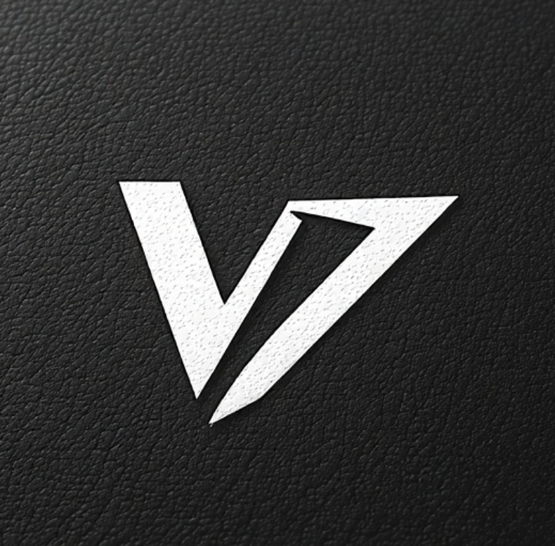

# V3XV0ID Image Animator

## 🎭 Professional Live Visual Performance Tool

A cutting-edge dual-palette crossfading image and video animator with V3XV0ID cyber aesthetic branding, designed for VJs, live performers, and visual artists.



## ✨ Features

### 🎛️ **Dual Palette System**
- Professional DJ/VJ-style crossfader interface
- Independent Palette A and B with seamless mixing
- Real-time crossfading between content palettes

### 🎬 **Live Video Support**
- Support for .mp4, .mov, .avi, .webm, .mkv files
- Real-time video playback with autoloop
- Mixed media support (images + videos in same layer)

### 🖼️ **Multi-Layer Image Animation**
- Unlimited layer support with individual controls
- Image sequence animation with customizable speed
- Drag-and-drop layer positioning and reordering

### 👁️ **Live Preview Windows**
- Real-time preview of Palette A content
- Real-time preview of Palette B content  
- Live mixed output preview with crossfader effects
- 20fps smooth animation in all preview windows

### 🎨 **Visual Effects**
- **Opacity Control** - Fade layers in/out
- **Scale/Size** - Resize layers dynamically
- **Jitter** - Add random movement effects
- **Strobe** - Rapid on/off flashing effects
- **Impact** - Rhythmic scale pulsing
- **Inverse Colors** - Real-time color inversion

### 🖱️ **Professional Interface**
- Intuitive drag-and-drop layer management
- Layer reordering with visual feedback
- Dual-window architecture (Control + Output)
- V3XV0ID cyber aesthetic with scan lines

### ⚡ **Performance Optimized**
- Real-time rendering for live performances
- Dual monitor support for professional setups
- Global pause/resume for precise control
- Crosshair cursor for precision positioning

## 📦 Installation

### Download Latest Release

Visit the [Releases](../../releases) page to download the latest version for your platform:

**macOS:**
- Intel Macs: `V3XV0ID-Image-Animator-vX.X.X-intel.dmg`
- Apple Silicon: `V3XV0ID-Image-Animator-vX.X.X-arm64.dmg`
- Portable: `.zip` files for both architectures

**Windows:**
- Installer: `V3XV0ID-Image-Animator-Setup-vX.X.X.exe`
- Portable: `V3XV0ID-Image-Animator-vX.X.X-portable.exe`

**Linux:**
- AppImage: `V3XV0ID-Image-Animator-vX.X.X.AppImage`
- Debian: `v3xv0id-image-animator_X.X.X_amd64.deb`

### Build from Source

```bash
# Clone the repository
git clone https://github.com/yourusername/image-animator.git
cd image-animator

# Install dependencies
npm install

# Run in development
npm start

# Build for your platform
npm run build-mac    # macOS
npm run build-win    # Windows
npm run build-linux  # Linux
```

## 🚀 Quick Start

1. **Launch** the V3XV0ID Image Animator
2. **Add Layers** to Palette A and B using the "+ ADD" buttons
3. **Load Content** into layers using the 📁 button (supports folders and individual files)
4. **Mix Palettes** using the crossfader between A and B
5. **Adjust Effects** with the controls panel (speed, size, opacity, etc.)
6. **Position Layers** by dragging them in the output window
7. **Live Performance** - Use dual monitors for control and output separation

## 🎛️ Controls Reference

### Layer Controls
- **👁️ Visibility** - Show/hide layer
- **📁 Load** - Load images/videos into layer
- **⧉ Duplicate** - Create copy of layer
- **✕ Delete** - Remove layer
- **⚫⚪ Inverse** - Toggle color inversion

### Effect Controls
- **Speed** - Animation speed (1-100ms intervals)
- **Size** - Layer scale (1-200%)
- **Jitter** - Random movement amount (0-50px)
- **Opacity** - Layer transparency (0-100%)
- **Strobe** - Flash frequency (0-20 Hz)
- **Impact** - Scale pulsing frequency (0-20 Hz)

### Global Controls
- **⏸️ Pause All** - Global pause/resume
- **🖼️ Set Background** - Default background image
- **Crossfader** - Mix between Palette A (left) and B (right)

## 🎯 Performance Tips

### For Live Shows
1. **Pre-load Content** - Load all images/videos before performance
2. **Use Dual Monitors** - Control window on laptop, output on projector
3. **Test Crossfader** - Practice smooth transitions between palettes
4. **Organize Layers** - Group similar content in same palette
5. **Use Hotkeys** - 'I' key for inverse toggle during performance

### Optimization
- Use compressed video formats (H.264 MP4 recommended)
- Keep image sequences under 100 files per layer for smooth performance
- Close other applications during live performance
- Use SSD storage for faster file loading

## 🛠️ Development

### Project Structure
```
image-animator/
├── racing-blasian/          # Main application code
│   ├── main.js             # Electron main process
│   ├── index.html          # Output window
│   ├── controls.html       # Control window
│   └── control-window.html # Legacy control window
├── .github/workflows/      # GitHub Actions CI/CD
├── dist/                   # Built distributions
└── package.json           # Project configuration
```

### Building Releases

To create a new release:

1. **Update Version** in `package.json`
2. **Commit Changes** to the repository
3. **Create Git Tag**: `git tag v1.1.0`
4. **Push Tag**: `git push origin v1.1.0`
5. **GitHub Actions** will automatically build and create the release

### Manual Building
```bash
# Build for specific platforms
npm run build-mac     # macOS (Intel + ARM64)
npm run build-win     # Windows (x64)
npm run build-linux   # Linux (x64)
npm run dist          # All platforms
```

## 🎨 V3XV0ID Aesthetic

The application features a distinctive cyber aesthetic with:
- Pure black backgrounds (#000000)
- White text and controls (#ffffff)
- Courier New monospace typography
- Scan line effects for retro-futuristic feel
- Minimalist geometric interfaces
- Crosshair cursors for precision

## 📄 License

ISC License - See LICENSE file for details.

## 🤝 Contributing

1. Fork the repository
2. Create a feature branch (`git checkout -b feature/amazing-feature`)
3. Commit your changes (`git commit -m 'Add amazing feature'`)
4. Push to the branch (`git push origin feature/amazing-feature`)
5. Open a Pull Request

## 📞 Support

For issues, feature requests, or questions:
- Open an [Issue](../../issues)
- Check existing [Discussions](../../discussions)
- Review the [Wiki](../../wiki) for advanced usage

---

**Perfect for VJs, live performers, and visual artists seeking professional-grade live visual tools with a distinctive cyber aesthetic.** 